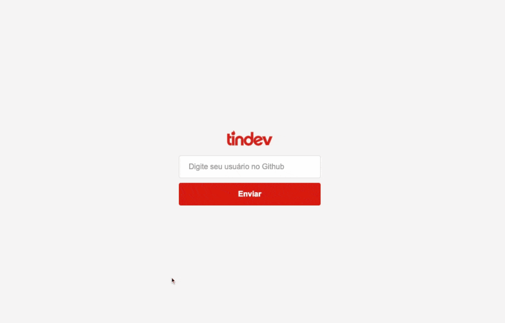
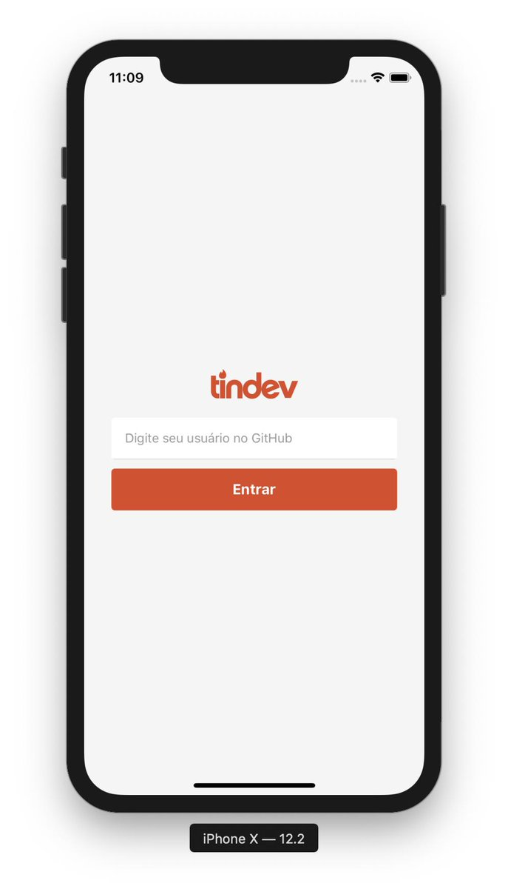

    A aplicação "Tindev" é um projeto desenvolvido durante a Semana OmniStack 8, da Rocketseat; é destinado a criar startups, projetos e novas tecnologias, encontrando por meio do GitHub, desenvolvedores com idéias e gostos parecidos; o usuário se cadastra (ou faz login) somente com o nome de usuário do GitHub, e pode fazer matches em real-time.

    Tecnologias utilizadas: 
    
    - React
    - React Native
    - NodeJS
    - Yarn
    - Npm
    - Axios
    - Mongoose 
    - Express
    - Cors
    - Socket.io
    - WebSocket
    - MongoDB

    
    

